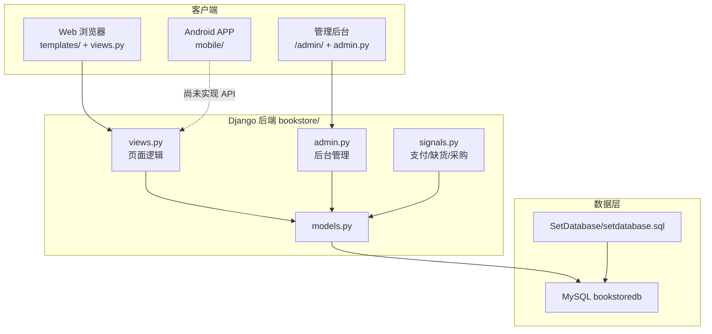

# MyBookwise 项目结构总览

网上书店系统，**Django 后端 + Web 网页 + Admin 管理后台 + Android APP（新建）**，共用 MySQL 数据库 `bookstoredb`。

```text
MyBookwise/                          ← 仓库根目录
├── manage.py                        ← Django 入口
├── README.md                        ← 功能说明 & 演示流程
├── pytest.ini                       ← 测试配置
│
├── MyBookwise/                      ← Django 工程配置
│   ├── settings.py                  ← 数据库、静态文件、Jazzmin 主题
│   ├── urls.py                      ← 总路由：/admin/ + 前台 bookstore/
│   ├── wsgi.py / asgi.py
│
├── bookstore/                       ← 核心业务 App（最重要）
│   ├── models.py                    ← 11 张表对应的 Model
│   ├── views.py                     ← 顾客端 Web 页面逻辑
│   ├── urls.py                      ← 前台 URL 路由
│   ├── admin.py                     ← 管理员后台 CRUD
│   ├── signals.py                   ← 订单支付、缺货、采购等自动化逻辑
│   ├── apps.py                      ← 启动时加载 signals
│   └── migrations/
│
├── templates/                       ← Web 页面模板
│   ├── bookstore/                   ← 顾客端页面
│   └── admin/                       ← Admin 样式覆盖
│
├── static/                          ← CSS、封面图等静态资源
│
├── SetDatabase/                     ← 数据库课设
│   └── setdatabase.sql              ← 建库脚本（表、视图、存储过程、触发器）
│
├── tests/                           ← pytest 单元/集成测试
│
└── mobile/                          ← Android APP（你负责，feature/mobile-app）
    └── app/src/main/java/com/example/bookwiseapp/
        └── MainActivity.kt          ← 目前是 Empty Activity 脚手架
```

---

## 三层架构（怎么分工）



| 端 | 目录 | 访问方式 |
|----|------|----------|
| **顾客 Web** | `views.py` + `templates/bookstore/` | `http://127.0.0.1:8000/` |
| **管理后台** | `admin.py` + Jazzmin | `http://127.0.0.1:8000/admin/` |
| **Android APP** | `mobile/` | 调后端 API（**待后端同学加 DRF**） |

---

## `bookstore/` 各文件职责

| 文件 | 作用 |
|------|------|
| **models.py** | 映射 MySQL 表，Model 均为 `managed = False`（表由 SQL 脚本管理） |
| **views.py** | 顾客端全部 Web 功能：登录、搜索、购物车、下单、账户 |
| **urls.py** | 前台路由，见下方页面清单 |
| **admin.py** | 书店内部管理：图书、客户、订单、缺货、采购、供应商 |
| **signals.py** | 业务规则：信用等级、支付扣款、订单状态变更、缺货→采购单 |
| **apps.py** | `ready()` 里 import signals，保证信号生效 |

---

## 数据模型（11 张表）

| Model | 含义 |
|-------|------|
| `Book` | 图书（ISBN、库存、最低库存等） |
| `Bookauthor` | 图书作者（最多 4 位、有序） |
| `Customer` | 顾客（余额、信用等级、累计消费） |
| `Creditlevel` | 信用等级规则（折扣、可否透支） |
| `Orders` / `Orderdetail` | 订单主表 / 明细 |
| `Shortagerecord` | 缺书登记 |
| `Procurement` / `Procurementdetail` | 采购单 / 明细 |
| `Supplier` / `Supplierbook` | 供应商 / 供货书目 |

---

## Web 顾客端页面（`bookstore/urls.py`）

| 路径 | 功能 |
|------|------|
| `/` | 首页图书列表 |
| `/search/` | 搜索 |
| `/book/<isbn>/` | 图书详情 |
| `/login/` `/register/` `/logout/` | 登录注册 |
| `/cart/` | 购物车 |
| `/order/confirm/` | 确认下单 |
| `/orders/` | 订单列表 |
| `/orders/<id>/` | 订单详情、付款、取消、确认收货 |
| `/account/` | 账户、充值、改资料、还透支 |


---

## 管理后台（`admin.py`）

书店内部日常业务：图书/客户/订单 CRUD、缺货登记、采购单、供应商等。使用 **Jazzmin** 美化 Django Admin。

---

## `signals.py` 自动化逻辑（业务核心）

- 订单创建/状态变更 → 扣余额或信用额度、退款、信用升级  
- 库存低于下限 → 自动生成缺货登记  
- 缺货登记 → 关联采购单  
- 采购到货 → 补库存、更新缺货状态  

Web 和（未来的）API 都应复用这套逻辑，不要在 APP 里重写。

---

## `mobile/`（APP 端）

- **技术栈**：Kotlin + Jetpack Compose  
- **包名**：`com.example.bookwiseapp`  
- **现状**：Android Studio 默认脚手架，尚未接后端  
- **Git 分支**：`feature/mobile-app`（已提交初始工程）

联调时 APP 指向：`http://10.0.2.2:8000`（模拟器）或局域网 IP（真机）。

---

## 测试与数据库

| 目录/文件 | 作用 |
|-----------|------|
| `tests/` | pytest：用户、购物车、订单、支付信号等 |
| `SetDatabase/setdatabase.sql` | 课设数据库完整定义 |
| MySQL `bookstoredb` | 运行时实际使用的库（配置在 `settings.py`） |

---

## 和你相关的要点

1. **你主要改 `mobile/`**；Web 在 `views.py` + `templates/`，Admin 在 `admin.py`。  
2. **目前还没有 REST API** — APP 需要后端同学在 `bookstore/` 里加 API（如 DRF），或先把接口清单给后端。  
3. **业务规则在 `signals.py` 和 `views.py`** — APP 只调接口，不要重复实现支付/信用逻辑。  
4. **数据库设计在 `SetDatabase/`** — 新功能若改表，这里和 `models.py` 要同步。

如果你接下来要做 APP，我可以按 `views.py` 里的功能帮你列一版 **API 接口清单**，方便和后端同学对齐。